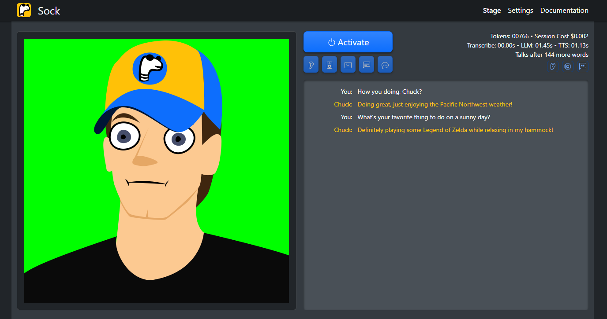

<p align="center">
  
</p>

# 🧦 Sock

Sock is an AI-controlled puppet that you can create your own custom avatar for and that is capable of interacting with you via text or voice. It utilizes OpenAI's [Whisper model](https://openai.com/research/whisper) transcription, [ChatGPT chat completion API](https://platform.openai.com/docs/guides/gpt/chat-completions-api), and speech synthesis through the browser's [Web Speech API](https://developer.mozilla.org/en-US/docs/Web/API/SpeechSynthesis) or [Coqui-AI's TTS](https://github.com/coqui-ai/TTS). Sock is designed to act as an AI co-host for Twitch streaming, or any application where you want to be able to converse and receive spoken responses from a Language Learning Model (LLM).

Sock operates through a [Next.js](https://nextjs.org/) application running in your web browser, which communicates with a [Python](https://www.python.org/downloads/) backend. This backend is responsible for managing the API calls to OpenAI, as well as running the Whisper transcription and Coqui-AI text-to-speech models.


<p align="center">
  
</p>

## 👨‍🎓 Information and Resources

For those with questions, thoughts, and discussion, we encourage you to use our repo's Issue Tracker and Discussions board. Help that's shared publicly there is valuable for the entire user base!

- 🐛 Bugs? Feature Requests?: Visit our [GitHub Issue Tracker](https://github.com/Didymos-IO/sock/issues)
- 🗨 Usage Questions? General Discussion?: Visit Our [GitHub Discussions](https://github.com/Didymos-IO/sock/discussions)
- 📖 Documentation?: Coming Soon on our [GitHub Wiki](https://github.com/Didymos-IO/sock/wiki)
- 🚗 Road Map: [Look right here](https://github.com/Didymos-IO/sock/wiki/Road-Map)

## 🏆 Features

- **Interactive Experience:** Engage in lively conversations with the Sock puppet through either text or voice.
- **Personalized Puppet:** Tailor the puppet to your liking by customizing its name, personality, and its focus on certain words.
- **Speech Synthesis:** Infuse more life into your puppet by selecting from a variety of voice models and settings.
- **ChatGPT API Configuration:** Easily access settings to adjust the behavior of the ChatGPT API for an optimized user experience.
- **Custom Avatar:** Add a personal touch by overlaying one or more layers of your own images to create the puppet's avatar. Test and preview this avatar in the settings panel.
- **Behavior Settings:** Gain granular control over the puppet's behavior. Adjust its chattiness, set it to respond immediately when called by name, and choose whether it should speak out loud or listen to your voice versus reading text.
- **Twitch Chat Integration:** _Coming soon!_ Seamlessly integrate your puppet with Twitch chat for a fully immersive streaming experience.

## 💾 Installation Guide

> (Are there issues with this guide? Please let us know by opening an issue!)

### Dependencies

Make sure to have your various dependencies installed.

- [Node.js and NPM](https://nodejs.org/)
- [Yarn](https://classic.yarnpkg.com/lang/en/docs/install/#windows-stable)
- [Python 3.10](https://www.python.org/downloads/)
- [eSpeak](https://github.com/espeak-ng/espeak-ng/releases) (for Coqui-AI TTS models)
- [FFmpeg](https://ffmpeg.org/download.html) ([Install Instructions for Windows](https://phoenixnap.com/kb/ffmpeg-windows))

**If using Coqui-AI for speech synthesis with GPU support**

- [NVIDIA CUDA v11](https://developer.nvidia.com/cuda-11.0-download-archive) - v12 isn't compatible, use v11

### Installing Frontend

To install the frontend, navigate to your terminal and execute:

```
yarn install
```

### Installing Backend

To install the backend, navigate to your terminal and execute:

```
cd backend
python3 -m venv venv
venv\scripts\activate
pip install wheel
pip install -r requirements.txt
```

### Setting up eSpeak

ESpeak is necessary for some Text-to-Speech (TTS) models. Here's how to set it up:

1. Download eSpeak from the [official GitHub repository](https://github.com/espeak-ng/espeak-ng/releases).
2. If you are on Windows, add the path to espeak-ng.exe to your PATH variable. See below for instructions.
   - Search for "edit system variables" in your OS's search menu.
   - Click the appropriate control panel option to open it.
   - Click the "Environment Variables" button.
   - Under the "System Variables" section, select "Path" and click "Edit".
   - Click "New" and add the path to espeak-ng.exe.
   - Restart your terminal to update the PATH variable.

### Set Up The Backend Environment Variables

Create a `.env` file in the `backend` directory with the following contents:

```
OPENAI_API_KEY={your openai api key}
OPENAI_CHAT_MODEL="gpt-3.5-turbo-0301"
TTS_USE_GPU="True"
```

**OPENAI_API_KEY**

In order to get an OpenAI API key, you need to:

1. **Sign Up:** Visit the OpenAI [sign up page](https://platform.openai.com/signup) and create an account.
2. **Setup Billing:** Follow the instructions to setup your billing details. This step is necessary to receive your API key.
   The OpenAI API version utilized by Sock is highly cost-efficient. It can process roughly 37,500 words, encompassing both prompts and responses, for a mere $0.01.

**OPENAI_CHAT_MODEL**

Sock permits the usage of different chat models based on your preference. If you wish to use an alternative model, you can replace the default one in the `.env` file.

To see a list of compatible models for /v1/chat/completions, refer to the [OpenAI's model compatibility documentation](https://platform.openai.com/docs/models/model-endpoint-compatibility).

**TTS_USE_GPU**

When using Coqui-AI for Sock's text-to-speech (TTS), you can set `TTS_USE_GPU="True"` to use NVIDIA CUDA for GPU-based processing. If your system does not support CUDA, you can modify the `TTS_USE_GPU` value to `"False"`. This will use the CPU for TTS processing, which will result in a slower response time. Alternatively, you could utilize Web Speech for faster execution, albeit with its more robotic voices.

## 🧦 Running Sock

Open two terminal windows.

1. In the first terminal, run the following command to start the backend:

```

yarn backend

```

2. In the second terminal window, run the following command to start the frontend:

```

yarn frontend

```

Finally, open a browser and navigate to http://localhost:3000.

You're good to go! 🎉

## Troubleshooting

If you get an error like `TypeError: argument of type 'NoneType' is not iterable` when you run `yarn backend`, you may need to forcibly reinstall whisper. Do the following in your terminal, which should help fix this:

```
cd backend
pip install --upgrade --no-deps --force-reinstall git+https://github.com/openai/whisper.git
```
